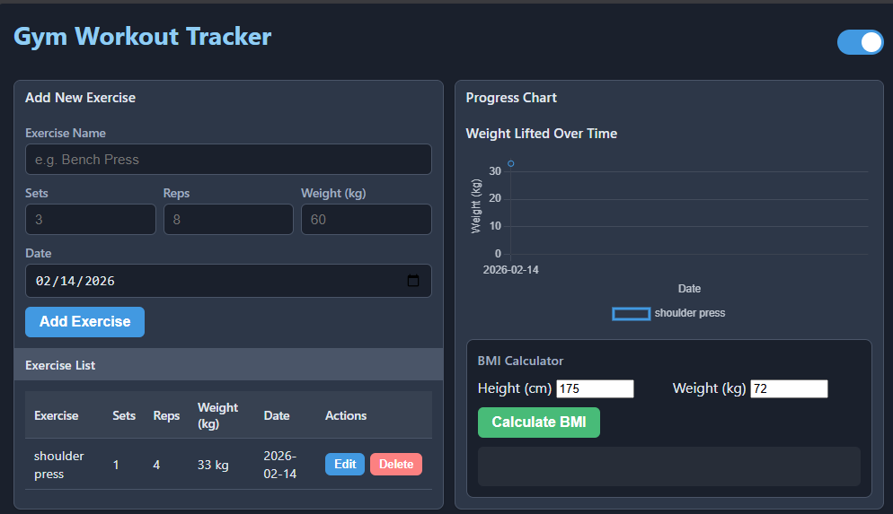
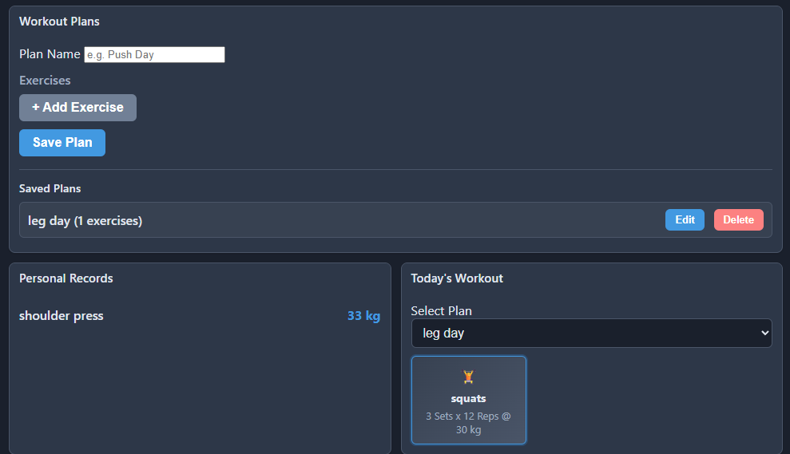

# Gym Workout Tracker

A practical and feature-rich workout tracking application built with jQuery. Track your exercises, monitor progress, manage workout plans, and stay on top of your fitness goals.



## Features

### CRUD Operations
- **Exercises** – Add, edit, and delete exercise entries
- **Sets & Reps** – Log sets, repetitions, and weight (kg) for each exercise
- **Weight Lifted** – Track weight progression over time
- **Workout Plans** – Create, edit, and delete custom workout plans with multiple exercises

### Advanced Features
- **Progress Chart** – Visualize weight lifted over time per exercise (Chart.js line chart)
- **PR Tracking** – Automatically tracks personal records for each exercise
- **BMI Calculator** – Calculate BMI with height (cm) and weight (kg), with classification (Underweight, Normal, Overweight, Obese)
- **Today's Workout** – Select a plan and view your workout for the day with exercise cards

### UI/UX
- **Dark & Light Mode** – Toggle between themes; dark mode is the default
- **Responsive Layout** – Adapts to different screen sizes
- **localStorage** – All data persists in the browser

## Screenshots

**Main Dashboard (Exercise Tracker + Progress Chart + BMI)**  


**Workout Plans, Personal Records & Today's Workout**  


## Tech Stack

- **HTML5** – Structure
- **CSS3** – Styling with CSS variables for theming
- **jQuery 4.0** – DOM manipulation and event handling
- **Chart.js** – Progress chart visualization

## Project Structure

```
jquery_CRUD/
├── index.html          # Main HTML file
├── styles.css          # Styles and theme variables
├── app.js              # jQuery application logic
├── jquery-4.0.0.min.js # jQuery library
├── output1.png         # Dashboard screenshot
├── output2.png         # Workout plans screenshot
└── README.md           # This file
```

## Getting Started

### Prerequisites
- A modern web browser (Chrome, Firefox, Edge, Safari)
- No build tools or server required

### Installation
1. Clone or download this repository
2. Ensure `jquery-4.0.0.min.js` is in the project folder
3. Open `index.html` in your browser

### Run Locally (Optional)
For a better development experience, you can use a simple local server:

```bash
# Using Python 3
python -m http.server 8000

# Using Node.js (npx)
npx serve
```

Then open `http://localhost:8000` (or the port shown) in your browser.

## Usage

1. **Add Exercise** – Fill in exercise name, sets, reps, weight, and date, then click Add Exercise
2. **Edit/Delete** – Use the Edit and Delete buttons in the Exercise List table
3. **Create Plan** – Add plan name, add exercises with "+ Add Exercise", then Save Plan
4. **Today's Workout** – Select a saved plan from the dropdown to view your workout cards
5. **BMI Calculator** – Enter height and weight, then click Calculate BMI
6. **Theme Toggle** – Use the switch in the header to switch between dark and light mode

## Data Storage

All data is stored in the browser's `localStorage`:
- Exercise history
- Workout plans
- Today's selected plan
- Theme preference (dark/light)

## License

This project is open source and available for personal and educational use.
